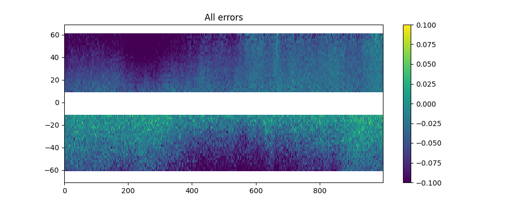

Simulation of errors
====================

The software generates random realizations of instrument errors and noise over
the interpolated SSH, as well as simulated geophysical errors. These error
simulations can be adjusted to match updates of the error budget estimation from
the SWOT project team. :ref:`Fig. 4 <Fig4>` shows a realization of a SWOT error
field generated by the software. It is the sum of random realizations of
multiple error components described in the following. :ref:`Fig. 3c <Fig3>`
shows the “observed” SSH when simulated noise is added to the interpolated SSH.

.. _Fig4:

   FIG. 4: Random realization of the error field (in meters). Swath coordinates
   are in km.

.. _Instrumentalerrors:

.. toctree::
   :maxdepth: 1

   errors/instrumental
   errors/geophysical
   errors/total
