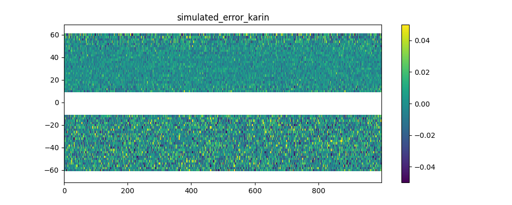
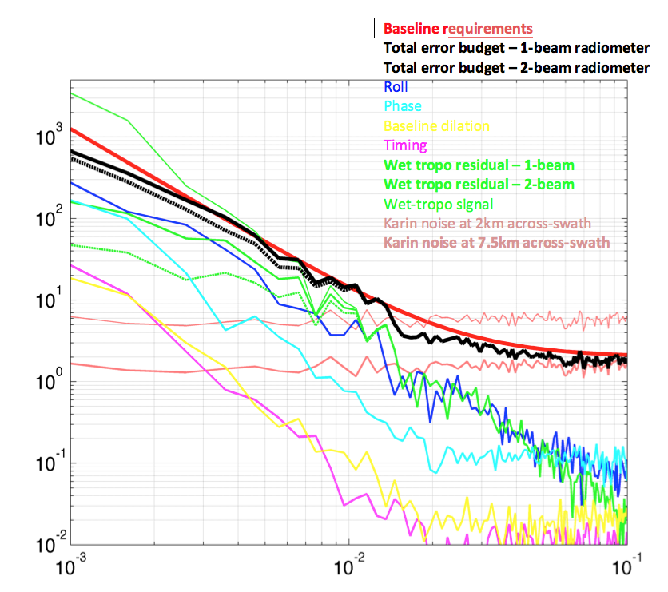

Simulation of errors
====================

The software generates random realizations of instrument errors and noise over
the interpolated SSH, as well as simulated geophysical errors. These error
simulations can be adjusted to match updates of the error budget estimation from
the SWOT project team. :ref:`Fig. 4 <Fig4>` shows a realization of a SWOT error
field generated by the software. It is the sum of random realizations of
multiple error components described in the following. :ref:`Fig. 3c <Fig3>`
shows the “observed” SSH when simulated noise is added to the interpolated SSH.

.. _Fig4:

.. figure:: ./images/Fig4.png
   :alt: Random realization of an error field

   FIG. 4: Random realization of the error field (in meters). Swath coordinates are in km. 

.. _Instrumentalerrors:

Instrumental errors
--------------------

The following components of instrumental errors are implemented in the software:
the KaRIN noise, the roll errors, the phase errors, the baseline dilation errors
and the timing errors. Random realizations of the noise and errors are performed
following the statistical descriptions of the SWOT error budget document
(:ref:`Esteban-Fernandez et al., 2014 <Esteban-Fernandez2014>`).

The KaRIN noise
```````````````

The KaRIN noise is random from cell to cell, defined by a Gaussian zero-centered
distribution of standard deviation inversely proportional to the square root of
the cell surface. In the simulator, the KaRIN noise varies with the distance to
the nadir and the Significant Wave Height (SWH) specified as a constant value
between 0 and 8 meters. For a grid cell of :math:`1km^2`, the standard deviation
of the KaRIN noise follows the curve shown on :ref:`Fig. 5 <Fig5>` with SWH
varying from 0 to 8~m (:ref:`Esteban-Fernandez et al., 2014
<Esteban-Fernandez2014>`). :ref:`Fig. 6 <Fig6>` shows a random realization
produced by the software with :math:`1km^2` grid cells and SWH=2~m.

.. _Fig5:

.. figure:: ./images/Fig5.png
   :scale: 60%
   :alt: Standard deviation of KaRIN noise

   FIG. 5: The example curves of the standard deviation (cm) of the KaRIN noise
   as a function of cross-track distance (km).

.. _Fig6:



   FIG. 6: Random realization of the KaRIN noise (m) following the standard
   deviation shown Fig. 5, with 2~km by 2~km grid cells and a varying SWH.

The user can define a constant value for the swh or use swh varying in time and
space. In the second scenario, a plugin is necessary to read the swh and
interpolate it on the SWOT grid. The plugin is similar to the one used for the
SSH.

Roll knowledge and control errors
`````````````````````````````````

As detailed in :ref:`Esteban-Fernandez et al., 2014 <Esteban-Fernandez2014>`,
the roll error signal is the sum of two components: the roll error knowledge
(also called gyro error) and the roll control errors. An estimation of the
along-track power spectral density of the two roll angles is given in the input
file ‘global_sim_instrument_error.nc’ from the SWOT project. It is represented
on :ref:`Fig. 7 <Fig7>`.

.. _Fig7:

.. figure:: ./images/Fig7.png
   :scale: 60%
   :alt: Power spectral density of the roll error

   FIG. 7: Estimation of the power spectral density of the gyro error angle
   (blue) and the roll control error angle (green).

Following these spectra, random realizations of an along-track roll angle
:math:`\theta_{roll}` (al) are performed with uniform phase distribution. The
algorithm of the random realization is described in APPENDIX A. From
:math:`\theta_{roll}` (al) in arcsecond unit, the power spectrum of the gyro
knowledge error plus the roll control error, the total roll error h_roll (in
meters) at a distance ac (in km) from the nadir is given by (see
:ref:`Esteban-Fernandez et al., 2014 <Esteban-Fernandez2014>`):

.. math:: 
   h_{roll} (al,ac)=(1+ \frac{H}{Re}) \theta_{roll} (al) \frac{\pi}{648} ac

where H is the altitude of the satellite and Re the earth radius. An example of
realization is shown on :ref:`Fig. 8 <Fig8>`.

.. _Fig8:

.. figure:: ./images/Fig8.png
   :alt: Random realization of the roll error

   FIG. 8a: Random realization of the roll error (in m) following the power
   spectra of the roll angle shown Fig. 7.

.. figure:: ./images/Fig8b.png
   :alt: Roll and phase error after cross-calibration

   FIG. 8b: Remaining roll and phase error after cross-calibration (in m).

As the roll error is large, a cross-calibration has been performed for two
cycles and for one year. A file is available and contains roll, phase and the
correction of roll and phase usin cross-calibration algorithms. The user can use
this file to simulate the roll and phase after cross-calibration.

Phase errors
````````````

An estimation of the along-track power spectrum of phase error is also given in
the input file ‘global_sim_instrument_error.nc’. It is represented on :ref:`Fig.
9 <Fig9>`.

.. _Fig9:

.. figure:: ./images/Fig9.png
   :scale: 60%
   :alt: Power spectral density of the phase error

   FIG. 9: Estimation of the power spectral density of the phase error

Following this power spectrum, random realizations of an along-track phase error
:math:`\theta` (al) are performed with uniform phase distribution. From
:math:`\theta` (al)  in deg. unit, the phase error on the height
:math:`h_{\theta}` (in meters) at a distance ac (in km) from the nadir is given
by (see :ref:`Esteban-Fernandez et al., 2014 <Esteban-Fernandez2014>`):

.. math::
   h_{\theta} (al, ac) = \frac{1}{K_{Ka}B}(1+\frac{H}{Re})\theta (al) \frac{100 \pi}{18}ac

An independent realization of :math:`\theta` is chosen for the left (ac<0) and
right (ac>0) swaths. As a result, the error is decorrelated between the 2 sides
(as opposed to the case of roll error), as illustrated on the random realization
shown on :ref:`Fig. 10 <Fig10>`.

.. _Fig10:

.. figure:: ./images/Fig10.png
   :alt: Random realization of the phase error

   FIG. 10: Random realization of the phase error on height (in m) following the
   power spectra of the phase error shown Fig. 9 (with filtering of long
   wavelengths).

Like mentioned in the section regarding the roll error, the phase error is
corrected using cross-calibration algorithm and available in a file that
contains either two cycles or one year of data. Note that only the
roll-phase-correction is available as it is not possible to correct them
individually.


Baseline dilation errors
````````````````````````

The baseline dilation and its resulting height measurement error is also
implemented, although the errors are significantly less important than the roll
and phase errors. The along-track power spectrum of the dilation :math:`\delta
B` is also given in the input file ‘global_sim_instrument_error.nc’. It is
represented on :ref:`Fig. 11 <Fig11>`.

.. _Fig11:

.. figure:: ./images/Fig11.png
   :scale: 60%
   :alt: Power spectral density of the baseline dilation

   FIG. 11: Estimation of the power spectral density of the baseline dilation.

Following this power spectrum, random realizations of an along-track baseline
dilation :math:`\delta B` are performed with uniform phase distribution. From
:math:`\delta B` in :math:`\mu m`, the baseline dilation error on the height
:math:`h_{\delta B}` (in meters) at a distance ac (in km) from the nadir is
given by the following formula (see :ref:`Esteban-Fernandez et al., 2014
<Esteban-Fernandez2014>`):

.. math::
   h_{\delta B} (al, ac) = -(1+\frac{H}{Re})\frac{\delta B(al)}{HB}ac^2

.. figure:: ./images/Fig12.png
   :alt: Random realization of the baseline dilation error.

   FIG. 12: Random realization of the baseline dilation error on height (in m)
   following the power spectra of the baseline dilation shown Fig. 11 (with
   filtering of long wavelengths).

Timing errors
`````````````

The timing errors are also minor compared to roll and phase errors, but are
implemented in the software. The along-track power spectrum of the timing error
:math:`\tau` is also given in the input file ‘global_sim_instrument_error.nc’.
It is represented on :ref:`Fig. 13 <Fig13>`.

.. _Fig13:

.. figure:: ./images/Fig13.png
   :scale: 60%
   :alt: Power spectral density of the timing error

   FIG. 13: Estimation of the power spectral density of the timing error

Following this power spectrum, random realizations of an along-track timing
error :math:`\tau` are performed with uniform phase distribution. From
:math:`\tau` (al) in *pico seconds*, the timing error on the height
:math:`h_\tau` (in meters) at a distance ac (in km) from the nadir is given by
(see :ref:`Esteban-Fernandez et al., 2014 <Esteban-Fernandez2014>`):

.. math:: 
   h_\tau (al,ac)=\frac{c}{2} \tau (al) \times 10^{-12}

Where c is the speed of light in m/s. The timing errors are constant in the
across swath direction but independant in each part of the sath. An example is
shown on :ref:`Fig. 14 <Fig14>`.

.. _Fig14:

.. figure:: ./images/Fig14.png
   :alt: Random realization of timing error

   FIG. 14: Random realization of timing error on height (in m) following the
   power spectra of the timing error shown Fig. 13 (with filtering of long
   wavelengths).

Geophysical errors
-------------------

So far, only the major geophysical source of error, the wet troposphere error,
has been implemented in the software in a quite simple way. More realistic
simulation will be hopefully implemented in the future versions.

.. _Wettroposphereerrors:

Wet troposphere errors
``````````````````````

The software simulates errors in the water vapor path delay retrieval with the
option of a 1-beam radiometer configuration or a 2-beam radiometer
configuration. First, a 2D random signal is generated around the swath following
a 1D input spectrum, with uniform phase distribution as described in APPENDIX A.
By default in the software, the 1D spectrum is the global average of estimated
path delay spectrum from the AMSR-E instrument and from the JPL’s High Altitude
MMIC Sounding Radiometer (Brown et al.) for the short wavelength. This spectrum
is expressed by the following formula (in cm2/(cy/km)):

.. math::
   S_{wet}=3.156 \times 10^{-5} f^{-8/3} \  for\ 3000km > \lambda > 100km

   S_{wet}=1.4875 \times 10^{-4} f^{-2.33} \  for\ \lambda \leq 100km

:ref:`Fig. 15 <Fig15>` shows a random realization of the path delay following
the above spectrum. By modifying the code, the user can change the power
spectrum to match the water vapor characteristics of a particular region, by
using for example the global climatology provided in :ref:`Ubelmann et al., 2013
<Ubelmannetal2013>`. 

.. _Fig15:

.. figure:: ./images/Fig15.png
   :alt: Random realization of wet-tropospheric path delay

   FIG. 15: Random realization of wet-tropospheric path delay without correction
   (in meters).

From the 2D random signal, the software simulates the residual error after
correction for the estimated path delay from the radiometer. By default, the
number of radiometer beams is set to 1. We considered that the radiometer (with
1 or 2 beams) measure the path delay averaged over a 2D Gaussian footprint with
standard deviation :math:`\sigma_0` (in km). :math:`\sigma_0` is set at 8~km by
default (corresponding to an overall 20~km diameter beam, close to the
characteristic of the AMR radiometer on Jason-2), but can be modified by the
user since the beam characteristics are not yet fixed by the project team. An
additional radiometer instrument error is considered, given by the following
characteristics (in cm2/(cy/km , see :ref:`Esteban-Fernandez et al., 2014
<Esteban-Fernandez2014>`):

.. math::
   S_{wet\_instr}=9.5×10^{-5} f^{-1.79} \  for\ 10^{-3} \leq f < 0.0023

   S_{wet\_instr}=0.036f^{-0.814} \  for\ 0.0023 \leq f < 0.0683

   S_{wet\_instr}=0.32\  for\ f \geq 0.0683

The high frequencies of instrument error (below 25km wavelength) have been
filtered in the simulator. Indeed, this high-frequency signal can be easily
removed since it exceeds significantly the spectral characteristics of a water
vapor spectrum averaged over a 25~km diameter beam. The scheme on :ref:`Fig. 16
<Fig16>` shows how the residual error with a 1-beam or 2-beam radiometer is
calculated. In the 1-beam case, the single beam measurement around the nadir
plus a random realization of the radiometer instrument error is the estimate
applied across the swath. In the 2-beam case, the estimation across the swath is
a linear fit between the two measurements. :ref:`Fig. 17 <Fig17>` shows an
example of residual error after a 1-beam and a 2-beam correction.

.. _Fig16:

.. figure:: ./images/Fig16.png
   :alt: Simulation of path delay estimation and the residual error

   FIG. 16: Scheme showing the simulation of the path delay estimation and the
   residual error for a 1-beam (left) and 2-beam (right) radiometer
   configuration.

.. _Fig17:

.. figure:: ./images/Fig17.png
   :alt: Residual error after wet-tropospheric correction using a 2-beam or 1-beam radiometer

   FIG. 17: (a) Residual error after wet-tropospheric correction with the
   simulation of a 2-beam radiometer at 35~km away from nadir, from the
   simulated path delay on Fig. 15. (b) Residual error with the simulation of a
   1-beam radiometer at nadir. 


Sea state bias
```````````````

The Sea State Bias (or Electromagnetic bias) and its estimation are not
implemented in the software yet. If SWH input files are provided, SWH values are
interpolated and stored on the SWOT files. SSB can be simulated offline using
this output.

Other geophysical errors
`````````````````````````

The other geophysical errors (Dry-troposphere, Ionosphere) are not implemented
in the software since they have a minor impact on the mesoscales to be observed
by SWOT. 

.. raw:: latex

    \newpage

Total error budget
-------------------

The along-track power spectra of the different error components have been
computed to check the consistency with the baseline requirements. These spectra,
averaged across-track between 10~km and 60~km off nadir, are represented on
:ref:`Fig. 18 <Fig18>`. The total error budget with a 1-beam radiometer (thick
black curve) is indeed slightly below the error requirement (thick red curve).

Note that the along-track power spectrum of the KaRIN noise (dark pink thick
curve) sampled on a 2~km by 2~km grid is about 6 :math:`cm**2/(km/cy)`, which
exceeds the requirements for short wavelength. However, these requirements have
been defined for wavelength exceeding 15~km in the plan (2 dimensions). Sampled
at the Niquist frequency in the across swath direction (7.5~km), the noise drops
down to 2 :math:`cm2/(km/cy)` (thick dark pink curve).      

.. _Fig18:



   FIG. 18: Error budget in the spectral domain, computed from a random
   realization of the simulator. The spectral densities have been averaged
   across-swath between 10~km and 60~km off nadir, consistenly with the
   definition of the requirements.
