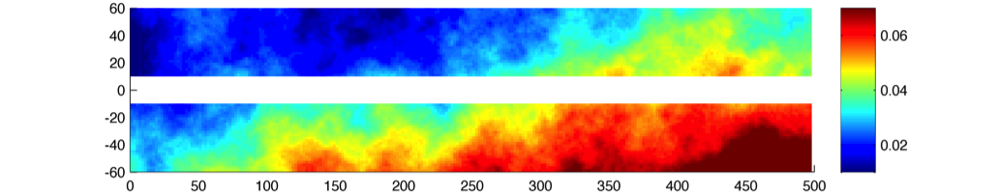
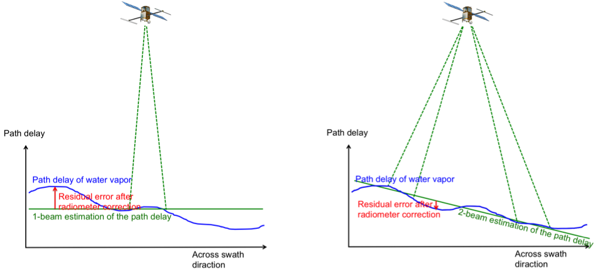
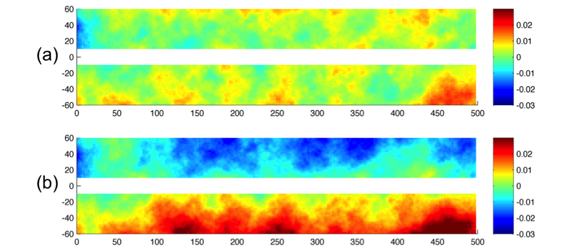

Geophysical errors
-------------------

So far, only the major geophysical source of error, the wet troposphere error,
has been implemented in the software in a quite simple way. More realistic
simulation will be hopefully implemented in the future versions.

.. _Wettroposphereerrors:

Wet troposphere errors
``````````````````````

The software simulates errors in the water vapor path delay retrieval with the
option of a 1-beam radiometer configuration or a 2-beam radiometer
configuration. First, a 2D random signal is generated around the swath following
a 1D input spectrum, with uniform phase distribution as described in APPENDIX A.
By default in the software, the 1D spectrum is the global average of estimated
path delay spectrum from the AMSR-E instrument and from the JPL’s High Altitude
MMIC Sounding Radiometer (Brown et al.) for the short wavelength. This spectrum
is expressed by the following formula (in cm2/(cy/km)):

.. math::
   S_{wet}=3.156 \times 10^{-5} f^{-8/3} \  for\ 3000 km > \lambda > 100 km

   S_{wet}=1.4875 \times 10^{-4} f^{-2.33} \  for\ \lambda \leq 100 km

:ref:`Fig. 15 <Fig15>` shows a random realization of the path delay following
the above spectrum. By modifying the code, the user can change the power
spectrum to match the water vapor characteristics of a particular region, by
using for example the global climatology provided in :ref:`Ubelmann et al., 2013
<Ubelmannetal2013>`.

.. _Fig15:



   FIG. 15: Random realization of wet-tropospheric path delay without
   correction (in meters).

From the 2D random signal, the software simulates the residual error after
correction for the estimated path delay from the radiometer. By default, the
number of radiometer beams is set to 1. We considered that the radiometer (with
1 or 2 beams) measure the path delay averaged over a 2D Gaussian footprint with
standard deviation :math:`\sigma_0` (in km). :math:`\sigma_0` is set at 8~km by
default (corresponding to an overall 20~km diameter beam, close to the
characteristic of the AMR radiometer on Jason-2), but can be modified by the
user since the beam characteristics are not yet fixed by the project team. An
additional radiometer instrument error is considered, given by the following
characteristics (in cm2/(cy/km , see :ref:`Esteban-Fernandez et al., 2014
<Esteban-Fernandez2014>`):

.. math::
   S_{wet\_instr}=9.5×10^{-5} f^{-1.79} \  for\ 10^{-3} \leq f < 0.0023

   S_{wet\_instr}=0.036f^{-0.814} \  for\ 0.0023 \leq f < 0.0683

   S_{wet\_instr}=0.32\  for\ f \geq 0.0683

The high frequencies of the instrument error (below 25 km wavelength) have been
filtered in the simulator. Indeed, this high-frequency signal can be easily
removed since it exceeds significantly the spectral characteristics of a water
vapor spectrum averaged over a 25~km diameter beam. The scheme in :ref:`Fig. 16
<Fig16>` shows how the residual error with a 1-beam or 2-beam radiometer is
calculated. In the 1-beam case, the single beam measurement around the nadir
plus a random realization of the radiometer instrument error is the estimate
applied across the swath. In the 2-beam case, the estimation across the swath is
a linear fit between the two measurements. :ref:`Fig. 17 <Fig17>` shows an
example of residual error after a 1-beam and a 2-beam correction.

.. _Fig16:



   FIG. 16: Scheme showing the simulation of the path delay estimation and the
   residual error for a 1-beam (left) and 2-beam (right) radiometer
   configuration.

.. _Fig17:



   FIG. 17: (a) Residual error after wet-tropospheric correction with the
   simulation of a 2-beam radiometer at 35~km away from nadir, from the
   simulated path delay on Fig. 15. |br|
   (b) Residual error with the simulation of a 1-beam radiometer at nadir.


Sea state bias
```````````````

The Sea State Bias (or Electromagnetic bias) and its estimation are not
implemented in the software yet. If SWH input files are provided, SWH values are
interpolated and stored on the SWOT files. SSB can be simulated offline using
this output.

Other geophysical errors
`````````````````````````

The other geophysical errors (Dry-troposphere, ionosphere) are not implemented
in the software since they have a minor impact on the meso-scales to be observed
by SWOT.


.. |br| raw:: html

   <br />
