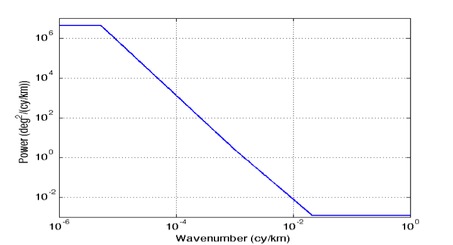

Instrumental errors
--------------------

The following components of instrumental errors are implemented in the software:
the KaRIN noise, the roll errors, the phase errors, the baseline dilation errors
and the timing errors. Random realizations of the noise and errors are performed
following the statistical descriptions of the SWOT error budget document
(:ref:`Esteban-Fernandez et al., 2014 <Esteban-Fernandez2014>`).

The KaRIN noise
```````````````

The KaRIN noise is random from cell to cell, defined by a Gaussian zero-centered
distribution of standard deviation inversely proportional to the square root of
the cell surface. In the simulator, the KaRIN noise varies with the distance to
the nadir and the Significant Wave Height (SWH) specified as a constant value
between 0 and 8 meters. For a grid cell of :math:`1km^2`, the standard deviation
of the KaRIN noise follows the curve shown in :ref:`Fig. 5 <Fig5>` with SWH
varying from 0 to 8~m (:ref:`Esteban-Fernandez et al., 2014
<Esteban-Fernandez2014>`). :ref:`Fig. 6 <Fig6>` shows a random realization
produced by the software with :math:`1km^2` grid cells and SWH=2~m.

.. _Fig5:

.. figure:: ../images/Fig5.png
   :align: left
   :alt: Standard deviation of KaRIN noise
   :figclass: align-left

   FIG. 5: The example curves of the standard deviation (cm) of the KaRIN noise
   as a function of cross-track distance (km).

.. _Fig6:

.. figure:: ../images/Fig6.png
   :align: left
   :alt: Random realization of the KaRIN noise
   :figclass: align-left

   FIG. 6: Random realization of the KaRIN noise (m) following the standard
   deviation shown Fig. 5, with 2~km by 2~km grid cells and a varying SWH.

The user can define a constant value for the SWH or use SWH varying in time and
space. In the second scenario, a plugin is necessary to read the SWH and
interpolate it on the SWOT grid. The plugin is similar to the one used for the
SSH.

Roll knowledge and control errors
`````````````````````````````````

As detailed in :ref:`Esteban-Fernandez et al., 2014 <Esteban-Fernandez2014>`,
the roll error signal is the sum of two components: the roll error knowledge
(also called gyro error) and the roll control errors. An estimation of the
along-track power spectral density of the two roll angles is given in the input
file ‘global_sim_instrument_error.nc’ from the SWOT project. It is represented
n :ref:`Fig. 7 <Fig7>`.

.. _Fig7:

.. figure:: ../images/Fig7.png
   :align: left
   :alt: Power spectral density of the roll error
   :figclass: align-left

   FIG. 7: Estimation of the power spectral density of the gyro error angle
   (blue) and the roll control error angle (green).

Following these spectra, random realizations of an along-track roll angle
:math:`\theta_{roll}` (al) are performed with uniform phase distribution. The
algorithm of the random realization is described in APPENDIX A. From
:math:`\theta_{roll}` (al) in arcsecond unit, the power spectrum of the gyro
knowledge error plus the roll control error, the total roll error h_roll (in
meters) at a distance ac (in km) from the nadir is given by (see
:ref:`Esteban-Fernandez et al., 2014 <Esteban-Fernandez2014>`):

.. math::
   h_{roll} (al,ac)=(1+ \frac{H}{Re}) \theta_{roll} (al) \frac{\pi}{648} ac

where H is the altitude of the satellite and Re the earth radius. An example of
realization is shown in :ref:`Fig. 8 <Fig8>`.

.. _Fig8:


   FIG. 8a: Random realization of the roll error (in m) following the power
   spectra of the roll angle shown at Fig. 7.


   FIG. 8b: Remaining roll and phase error after a cross-calibration (in m).

As the roll error is large, a cross-calibration has been performed for two
cycles and for one year. A file is available and contains roll, phase and the
correction of roll and phase using cross-calibration algorithms. The user can use
this file to simulate the roll and phase after cross-calibration.

Phase errors
````````````

An estimation of the along-track power spectrum of phase error is also given in
the input file ‘global_sim_instrument_error.nc’. It is represented in :ref:`Fig.
9 <Fig9>`.

.. _Fig9:



   FIG. 9: Estimation of the power spectral density of the phase error

Following this power spectrum, random realizations of an along-track phase error
:math:`\theta` (al) are performed with uniform phase distribution. From
:math:`\theta` (al)  in deg. unit, the phase error on the height
:math:`h_{\theta}` (in meters) at a distance ac (in km) from the nadir is given
by (see :ref:`Esteban-Fernandez et al., 2014 <Esteban-Fernandez2014>`):

.. math::
   h_{\theta} (al, ac) = \frac{1}{K_{Ka}B}(1+\frac{H}{Re})\theta (al) \frac{100 \pi}{18}ac

An independent realization of :math:`\theta` is chosen for the left (ac<0) and
right (ac>0) swaths. As a result, the error is uncorrelated between the 2 sides
(as opposed to the case of a roll error), as illustrated by the random realization
shown in :ref:`Fig. 10 <Fig10>`.

.. _Fig10:


   FIG. 10: Random realization of the phase error on the height (in m) following
   the power spectra of the phase error shown at Fig. 9 (with filtering of long
   wavelengths).

Like mentioned in the section regarding the roll error, the phase error is
corrected using cross-calibration algorithm and available in a file that
contains either two cycles or one year of data. Note that only the
roll-phase-correction is available as it is not possible to correct them
individually.


Baseline dilation errors
````````````````````````

The baseline dilation and its resulting height measurement error are also
implemented, although the errors are significantly less important than the roll
and phase errors. The along-track power spectrum of the dilation :math:`\delta
B` is also given in the input file ‘global_sim_instrument_error.nc’. It is
represented in :ref:`Fig. 11 <Fig11>`.

.. _Fig11:


   FIG. 11: Estimation of the power spectral density of the baseline dilation.

Following this power spectrum, random realizations of an along-track baseline
dilation :math:`\delta B` are performed with uniform phase distribution. From
:math:`\delta B` in :math:`\mu m`, the baseline dilation error on the height
:math:`h_{\delta B}` (in meters) at a distance ac (in km) from the nadir is
given by the following formula (see :ref:`Esteban-Fernandez et al., 2014
<Esteban-Fernandez2014>`):

.. math::
   h_{\delta B} (al, ac) = -(1+\frac{H}{Re})\frac{\delta B(al)}{HB}ac^2

.. figure:: ../images/Fig12.png
   :align: left
   :alt: Random realization of the baseline dilation error.
   :figclass: align-left

   FIG. 12: Random realization of the baseline dilation error on the height (in
   m) following the power spectra of the baseline dilation shown Fig. 11 (with
   filtering of long wavelengths).

Timing errors
`````````````

The timing errors are also minor compared to roll and phase errors, but are
implemented in the software. The along-track power spectrum of the timing error
:math:`\tau` is also given in the input file ‘global_sim_instrument_error.nc’.
It is represented in :ref:`Fig. 13 <Fig13>`.

.. _Fig13:


   FIG. 13: Estimation of the power spectral density of the timing error

Following this power spectrum, random realizations of an along-track timing
error :math:`\tau` are performed with uniform phase distribution. From
:math:`\tau` (al) in *pico seconds*, the timing error on the height
:math:`h_\tau` (in meters) at a distance ac (in km) from the nadir is given by
(see :ref:`Esteban-Fernandez et al., 2014 <Esteban-Fernandez2014>`):

.. math::
   h_\tau (al,ac)=\frac{c}{2} \tau (al) \times 10^{-12}

Where c is the speed of light in m/s. The timing errors are constant in the
across swath direction but independent in each part of the swath. An example is
shown in :ref:`Fig. 14 <Fig14>`.

.. _Fig14:


   FIG. 14: Random realization of timing error on the height (in m) following
   the power spectra of the timing error shown Fig. 13 (with filtering of long
   wavelengths).

Orbital errors
``````````````


   Random realization of the orbital error (in micro-radians).


   Zoom of the Random realization of the orbital error on the first day.
