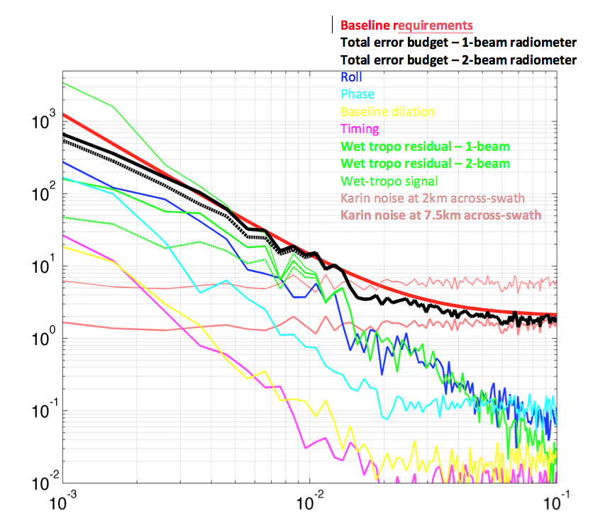

Total error budget
-------------------

The along-track power spectra of the different error components have been
computed to check the consistency with the baseline requirements. These spectra,
averaged across-track between 10~km and 60~km off nadir, are represented in
:ref:`Fig. 18 <Fig18>`. The total error budget with a 1-beam radiometer (thick
black curve) is indeed slightly below the error requirement (thick red curve).

Note that the along-track power spectrum of the KaRIN noise (dark pink thick
curve) sampled on a 2~km by 2~km grid is about 6 :math:`cm**2/(km/cy)`, which
exceeds the requirements for a short wavelength. However, these requirements have
been defined for wavelength exceeding 15~km in the plan (2 dimensions). Sampled
at the Niquist frequency in the across swath direction (7.5~km), the noise drops
down to 2 :math:`cm2/(km/cy)` (thick dark pink curve).      

.. _Fig18:

   FIG. 18: Error budget in the spectral domain, computed from a random
   realization of the simulator. The spectral densities have been averaged
   across-swath between 10~km and 60~km off nadir, consistenly with the
   definition of the requirements.
