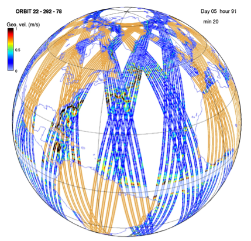

SWOT sampling
=============

From a global or regional OGCM configuration, the software generates Sea Surface
Height (SSH) on a 120~km wide swath at typically 1~km resolution. An
illustration of outputs for a global ECCO (MITgcm) configuration is shown on
:ref:`Fig. 1 <Fig1>`.

.. _Fig1:

   FIG. 1: 5-day worth of SWOT simulated data in a global configuration with the
   science orbit.

.. toctree::
   :maxdepth: 1

   sampling/interpolation
   sampling/orbit
   sampling/swath
