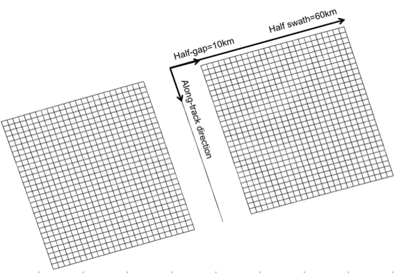

Simulation of the SWOT sampling over synthetic Sea Surface Height
=================================================================

From a global or regional OGCM configuration, the software generates SSH on a
120~km wide swath at typically 1~km resolution. An illustration of outputs for a
global ECCO (MITgcm) configuration is shown on :ref:`Fig. 1 <Fig1>`.

.. _Fig1:

.. figure:: ./images/Fig1.png 
   :alt: Science SWOT orbit

   FIG. 1: 5-day worth of SWOT simulated data in a global configuration with the science orbit.

.. _ProposedSWOTorbits:

Proposed SWOT orbits
---------------------

The software uses as an input the ground-tracks of the satellite orbit. The user
can choose between different orbits such as the fast sampling orbit (1-day
repeat), the science orbit (21-day repeat with a 10-day subcycle) and also the
contingency orbit (21-day repeat with 1-day subcycle). The table below shows the
characteristics of these 3 orbits:

+---------------------+--------------+--------------+------------+-------------+-----------+
|                     | Repeat Cycle | Repeat Cycle | Sub-cycles | Inclination | Elevation |
|                     | (days)       | (Orbits)     | (days)     |             | (km)      |
+=====================+==============+==============+============+=============+===========+
| Fast Sampling orbit | 0.99349      | 14           | N.A.       | 77.6        | 857       |
+---------------------+--------------+--------------+------------+-------------+-----------+
| Science Orbit       | 20.8646      | 292          | 1, 10      | 77.6        | 891       |
+---------------------+--------------+--------------+------------+-------------+-----------+
| Contingency orbit   | 20.8639      | 293          | 1          | 77.6        | 874       |
+---------------------+--------------+--------------+------------+-------------+-----------+

The ground-track coordinates corresponding to these orbits are given as input
ASCII files of 3 columns (longitude, latitude, time) for one complete cycle
sampled at every  ~5~km. The ascending node has been arbitrarily set to zero
degree of longitude, but the user can shift the orbit by any value in longitude.

Orbit files have been updated with the one provided by AVISO_ on september 2015
(https://www.aviso.altimetry.fr/en/missions/future-missions/swot/orbit.html).
There are two additional orbit files available in the last version of the
simulator. Input files are also ASCII with 3 columns (time, longitude,
latitude). Orbits are provided at low resolution and are interpolated
automatically by the simulator. `ephem_calval_june2015_ell.txt
<https://github.com/CNES/swot_simulator/blob/master/data/ephem_calval_june2015_ell.txt>`_
contains the updated fast sampling orbit and `ephem_science_sept2015_ell.txt
<https://github.com/CNES/swot_simulator/blob/master/data/ephem_science_sept2015_ell.txt>`_
the updated science orbit.

Other orbit files of the same format (time, longitude, latitude) can also be
used as an input. To avoid distortions in the SWOT grid, we recommend a minimum
of 10km sampling between the ground-track points of the orbit.

.. _AVISO: https://www.aviso.altimetry.fr/en/missions/future-missions/swot/orbit.html

The SWOT swath
---------------

From the orbit nadir ground track the software generates a grid covering the
SWOT swath over 1 cycle. In the across-swath direction, the grid is defined
between 10~km and 60~km off nadir. The grid size is 2 kilometers in the
along-track and across-track directions by default, but can be set at any other
value (e.g. 500~m or 250~m). The longitude and latitude coordinates are
referenced for each grid point, and the time coordinate (between 0 and t_cycle)
is referenced in the along-track direction only. A scheme of the SWOT grid is
presented on :ref:`Fig. 2 <Fig2>`. The SWOT grid is stored by pass (e.g. 292
ascending passes and 292 descending passes for the science orbit). A pass is
defined by an orbit starting at the lowest latitude for ascending track and at
the highest latitude for descending track (+/-77.6 for the considered SWOT
orbits). The first pass starts at the first lowest latitude crossing in the
input file, meaning that ascending passes are odd numbers and descending passes
are even numbers. 

.. _Fig2:

   FIG. 2: scheme of the SWOT grid at 2~km resolution.

Interpolation of SSH on the SWOT grid and nadir track
-------------------------------------------------------
SSH from the OGCM model is provided through a plugin. So far three plugins are
available: One for the aviso data, with a regular time step and a regular grid,
one for the LLC4320 MITGCM zar files available on CNES HAL supercomputer, and
one that handles a regional hycom simulation outputs. One can build their own
plugin compliant with their SSH inputs using the existing plugin as example or
contact us if they need help. The SSH is interpolated on the SWOT grid and nadir
track for each pass and successive cycles if the input data exceeds 1 cycle.The
nadir track has the same resolution as the SWOT grid in the along-track
direction, but it is possible to compute it separately with a different along
track resolution. On the SWOT grid, the 2D interpolation is linear in space. No
interpolation is performed in time: the SSH on the SWOT grid at a given time
corresponds to the SSH of the closest time step. This avoids contaminations of
the rapid signals (e.g. internal waves) if they are under-sampled in the model
outputs. However, note that locally, sharp transitions of the SSH along the
swath may occur if the satellite happens to be over the domain at the time of
transition between two time steps. :ref:`Fig. 3a <Fig3>` shows an input SSH as
an example. :ref:`Fig 3b <Fig3>` is the interpolated SSH on a 400km long segment
of the SWOT grid crossing the domain.

.. _Fig3:

.. figure:: ./images/Fig3.png
   :alt: Model SSH interpolated on SWOT grid

   FIG. 3: SSH (in meters) produced by the MITGCM high resolution model and filtered at 1/12º.

   .. table::
      :width: 70%
      :align: center

      +-----+-------------------------------------------------------------------+
      | *a* | SSH_model simulator output interpolated on the SWOT grid.         |
      +-----+-------------------------------------------------------------------+
      | *b* | “Observed” SSH, which is the sum of SSH_model and a random        |
      |     | realization of the total SWOT noise with the default parameters of|
      |     | the software.                                                     |
      +-----+-------------------------------------------------------------------+
