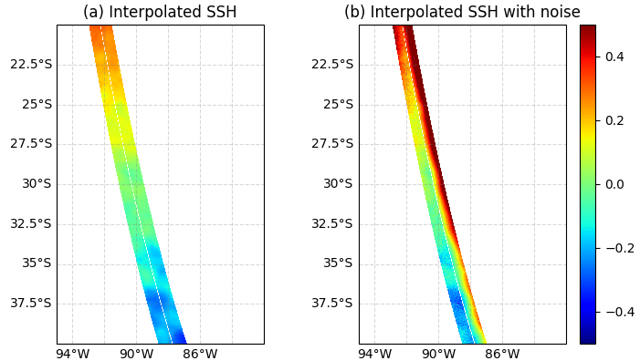

Interpolation of SSH
--------------------

SSH from the OGCM model is provided through a plugin. So far, three plugins are
available: One for the AVISO data, with regular time intervals and a Cartesian
grid, one for the LLC4320 MITGCM Zarr files available on CNES HAL supercomputer,
and one that handles regional HYCOM simulation outputs. One can build their
plugin compliant with their SSH inputs using the existing plugin as an example
or contact us if they need help. The SSH is interpolated on the SWOT grid and
nadir track for each pass and successive cycle if the input data exceeds one
cycle. The nadir track has the same resolution as the SWOT grid in the
along-track direction, but it is possible to compute it separately with a
different along-track resolution. On the SWOT grid, the 2D interpolation is
linear in space. No interpolation is performed in time: the SSH on the SWOT grid
at a given time corresponds to the SSH of the closest time step. This avoids
contamination of the rapid signals (e.g., internal waves) if they are
under-sampled in the model outputs. However, note that locally, sharp
transitions of the SSH along the swath may occur if the satellite happens to be
over the domain at the time of transition between two-time steps. :ref:`Fig. 3a
<Fig3>` shows an input SSH as an example. :ref:`Fig 3b <Fig3>` is the
interpolated SSH on a 400 km long segment of the SWOT grid crossing the domain.

.. _Fig3:

   FIG. 3: SSH (in meters) produced by the MITGCM high resolution model and filtered
   at 1/12º. |br| |br|
   (*a*): SSH_model simulator output interpolated on the SWOT grid. |br|
   (*b*): Observed SSH, which is the sum of SSH_model and a random
   realization |br| of the total SWOT noise with the default parameters of
   the software.

.. |br| raw:: html

    

