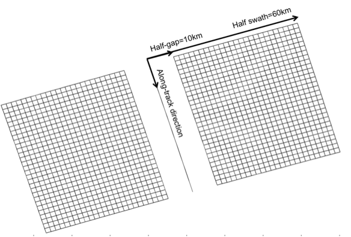

The SWOT swath
--------------

From the orbit nadir ground track the software generates a grid covering the
SWOT swath over 1 cycle. In the across-swath direction, the grid is defined
between 10~km and 60~km off nadir. The grid size is 2 kilometers in the
along-track and across-track directions by default, but can be set at any other
value (e.g. 500~m or 250~m). The longitude and latitude coordinates are
referenced for each grid point, and the time coordinate (between 0 and t_cycle)
is referenced in the along-track direction only. A scheme of the SWOT grid is
presented in :ref:`Fig. 2 <Fig2>`.

The SWOT grid is stored by pass (e.g. 292 ascending passes and 292 descending
passes for science orbit). A pass is defined by an orbit starting at the lowest
latitude for ascending track and at the highest latitude for descending track
(+/-77.6 for the SWOT orbits considered). The first pass starts at the first
lowest latitude crossing in the input file, meaning that ascending passes are
odd numbers and descending passes are even numbers.

.. _Fig2:

   FIG. 2: scheme of the SWOT grid at 2~km resolution.
