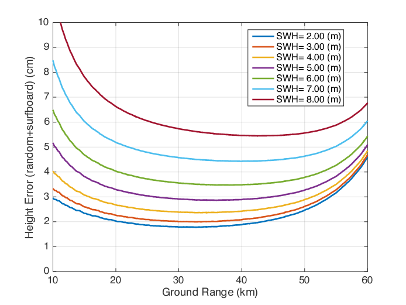
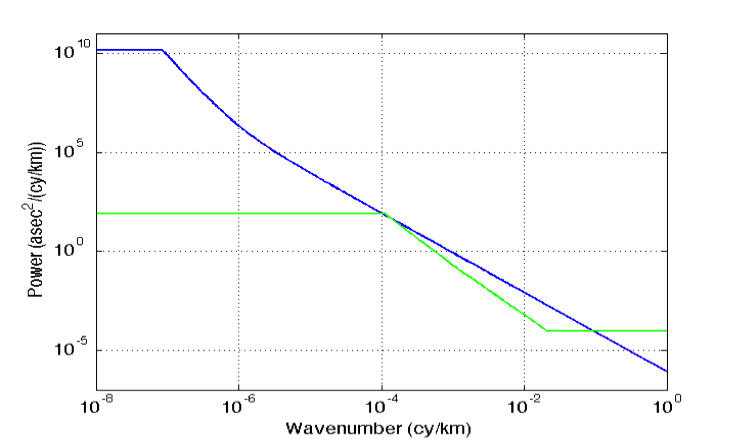
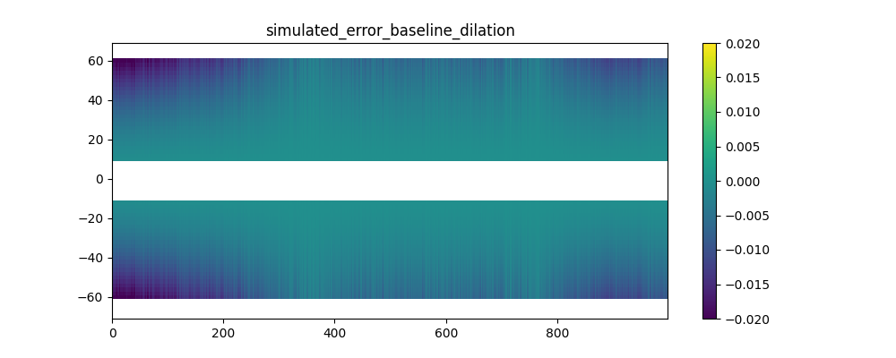
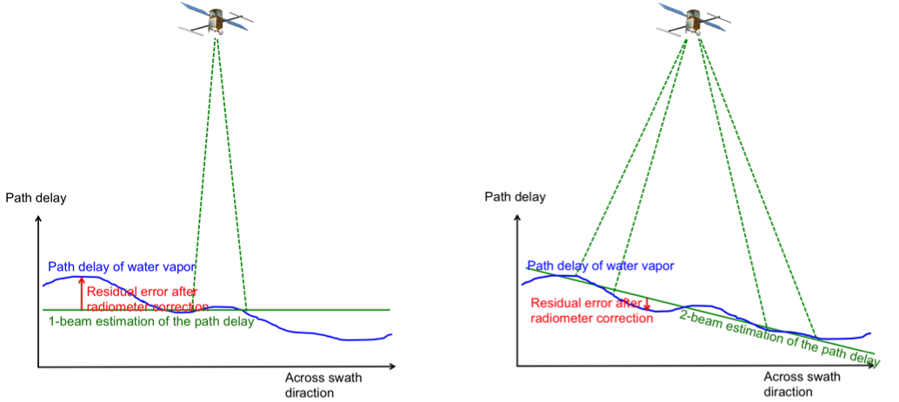

.. _science:

################################
SWOT Simulator for Ocean Science
################################
Clement Ubelmann, Lucile Gaultier and Lee-Lueng Fu

Jet Propulsion Laboratory, California Institute of Technology, CNES

Abstract:
=========

This software simulates sea surface height (SSH) synthetic observations of the
proposed SWOT mission that can be applied to an ocean general circulation model
(OGCM), allowing the exploration of ideas and methods to optimize information
retrieval from the SWOT Mission in the future. From OGCM SSH inputs, the
software generates SWOT-like outputs on a swath along the orbit ground track, as
well as outputs from a nadir altimeter. Some measurement error and noise are
generated according to technical characteristics published by the SWOT project
team. Not designed to directly simulate the payload instrument performance, this
SWOT simulator aims at providing statistically realistic outputs for the science
community with a simple software package released as an open source in Python.
The software is scalable and designed to support future evolution of orbital
parameters, error budget estimates from the project team and suggestions from
the science community.


Simulation of the SWOT sampling over synthetic Sea Surface Height
=================================================================

From a global or regional OGCM configuration, the software generates SSH on a
120~km wide swath at typically 1~km resolution. An illustration of outputs for a
global ECCO (MITgcm) configuration is shown on :ref:`Fig. 1 <Fig1>`.

.. _Fig1:

.. figure:: ./images/Fig1.png 
   :alt: Science SWOT orbit

   FIG. 1: 5-day worth of SWOT simulated data in a global configuration with the science orbit.

.. _ProposedSWOTorbits:

Proposed SWOT orbits
---------------------

The software uses as an input the ground-tracks of the satellite orbit. The user
can choose between different orbits such as the fast sampling orbit (1-day
repeat), the science orbit (21-day repeat with a 10-day subcycle) and also the
contingency orbit (21-day repeat with 1-day subcycle). The table below shows the
characteristics of these 3 orbits:

+---------------------+--------------+--------------+------------+-------------+-----------+
|                     | Repeat Cycle | Repeat Cycle | Sub-cycles | Inclination | Elevation |
|                     | (days)       | (Orbits)     | (days)     |             | (km)      |
+=====================+==============+==============+============+=============+===========+
| Fast Sampling orbit | 0.99349      | 14           | N.A.       | 77.6        | 857       |
+---------------------+--------------+--------------+------------+-------------+-----------+
| Science Orbit       | 20.8646      | 292          | 1, 10      | 77.6        | 891       |
+---------------------+--------------+--------------+------------+-------------+-----------+
| Contingency orbit   | 20.8639      | 293          | 1          | 77.6        | 874       |
+---------------------+--------------+--------------+------------+-------------+-----------+

The ground-track coordinates corresponding to these orbits are given as input
ASCII files of 3 columns (longitude, latitude, time) for one complete cycle
sampled at every  ~5~km. The ascending node has been arbitrarily set to zero
degree of longitude, but the user can shift the orbit by any value in longitude.

Orbit files have been updated with the one provided by AVISO_ on september 2015
(https://www.aviso.altimetry.fr/en/missions/future-missions/swot/orbit.html).
There are two additional orbit files available in the last version of the
simulator. Input files are also ASCII with 3 columns (time, longitude,
latitude). Orbits are provided at low resolution and are interpolated
automatically by the simulator. `ephem_calval_june2015_ell.txt
<https://github.com/CNES/swot_simulator/blob/master/data/ephem_calval_june2015_ell.txt>`_
contains the updated fast sampling orbit and `ephem_science_sept2015_ell.txt
<https://github.com/CNES/swot_simulator/blob/master/data/ephem_science_sept2015_ell.txt>`_
the updated science orbit.

Other orbit files of the same format (time, longitude, latitude) can also be
used as an input. To avoid distortions in the SWOT grid, we recommend a minimum
of 10km sampling between the ground-track points of the orbit.

.. _AVISO: https://www.aviso.altimetry.fr/en/missions/future-missions/swot/orbit.html

The SWOT swath
---------------

From the orbit nadir ground track the software generates a grid covering the
SWOT swath over 1 cycle. In the across-swath direction, the grid is defined
between 10~km and 60~km off nadir. The grid size is 2 kilometers in the
along-track and across-track directions by default, but can be set at any other
value (e.g. 500~m or 250~m). The longitude and latitude coordinates are
referenced for each grid point, and the time coordinate (between 0 and t_cycle)
is referenced in the along-track direction only. A scheme of the SWOT grid is
presented on :ref:`Fig. 2 <Fig2>`. The SWOT grid is stored by pass (e.g. 292
ascending passes and 292 descending passes for the science orbit). A pass is
defined by an orbit starting at the lowest latitude for ascending track and at
the highest latitude for descending track (+/-77.6 for the considered SWOT
orbits). The first pass starts at the first lowest latitude crossing in the
input file, meaning that ascending passes are odd numbers and descending passes
are even numbers. 

.. _Fig2:

.. figure:: ./images/Fig2.png
   :alt: SWOT grid

   FIG. 2: scheme of the SWOT grid at 2~km resolution.


Interpolation of SSH on the SWOT grid and nadir track
-------------------------------------------------------
SSH from the OGCM model is provided through a plugin. So far three plugins are
available: One for the aviso data, with a regular time step and a regular grid,
one for the LLC4320 MITGCM zar files available on CNES HAL supercomputer, and
one that handles a regional hycom simulation outputs. One can build their own
plugin compliant with their SSH inputs using the existing plugin as example or
contact us if they need help. The SSH is interpolated on the SWOT grid and nadir
track for each pass and successive cycles if the input data exceeds 1 cycle.The
nadir track has the same resolution as the SWOT grid in the along-track
direction, but it is possible to compute it separately with a different along
track resolution. On the SWOT grid, the 2D interpolation is linear in space. No
interpolation is performed in time: the SSH on the SWOT grid at a given time
corresponds to the SSH of the closest time step. This avoids contaminations of
the rapid signals (e.g. internal waves) if they are under-sampled in the model
outputs. However, note that locally, sharp transitions of the SSH along the
swath may occur if the satellite happens to be over the domain at the time of
transition between two time steps. :ref:`Fig. 3a <Fig3>` shows an input SSH as
an example. :ref:`Fig 3b <Fig3>` is the interpolated SSH on a 400km long segment
of the SWOT grid crossing the domain.

.. _Fig3:

.. figure:: ./images/Fig3.png
   :alt: Model SSH interpolated on SWOT grid

   FIG. 3: SSH (in meters) produced by the MITGCM high resolution model and filtered at 1/12º.

   .. table::
      :width: 70%
      :align: center

      +-----+-------------------------------------------------------------------+
      | *a* | SSH_model simulator output interpolated on the SWOT grid.         |
      +-----+-------------------------------------------------------------------+
      | *b* | “Observed” SSH, which is the sum of SSH_model and a random        |
      |     | realization of the total SWOT noise with the default parameters of|
      |     | the software.                                                     |
      +-----+-------------------------------------------------------------------+

Simulation of errors
====================

The software generates random realizations of instrument errors and noise over
the interpolated SSH, as well as simulated geophysical errors. These error
simulations can be adjusted to match updates of the error budget estimation from
the SWOT project team. :ref:`Fig. 4 <Fig4>` shows a realization of a SWOT error
field generated by the software. It is the sum of random realizations of
multiple error components described in the following. :ref:`Fig. 3c <Fig3>`
shows the “observed” SSH when simulated noise is added to the interpolated SSH.

.. _Fig4:

.. figure:: ./images/Fig4.png
   :alt: Random realization of an error field

   FIG. 4: Random realization of the error field (in meters). Swath coordinates are in km. 

.. _Instrumentalerrors:

Instrumental errors
--------------------

The following components of instrumental errors are implemented in the software:
the KaRIN noise, the roll errors, the phase errors, the baseline dilation errors
and the timing errors. Random realizations of the noise and errors are performed
following the statistical descriptions of the SWOT error budget document
(:ref:`Esteban-Fernandez et al., 2014 <Esteban-Fernandez2014>`).

The KaRIN noise
```````````````

The KaRIN noise is random from cell to cell, defined by a Gaussian zero-centered
distribution of standard deviation inversely proportional to the square root of
the cell surface. In the simulator, the KaRIN noise varies with the distance to
the nadir and the Significant Wave Height (SWH) specified as a constant value
between 0 and 8 meters. For a grid cell of :math:`1km^2`, the standard deviation
of the KaRIN noise follows the curve shown on :ref:`Fig. 5 <Fig5>` with SWH
varying from 0 to 8~m (:ref:`Esteban-Fernandez et al., 2014
<Esteban-Fernandez2014>`). :ref:`Fig. 6 <Fig6>` shows a random realization
produced by the software with :math:`1km^2` grid cells and SWH=2~m.

.. _Fig5:



   FIG. 5: The example curves of the standard deviation (cm) of the KaRIN noise
   as a function of cross-track distance (km).

.. _Fig6:

.. figure:: ./images/Fig6.png
   :alt: Random realization of the KaRIN noise

   FIG. 6: Random realization of the KaRIN noise (m) following the standard
   deviation shown Fig. 5, with 2~km by 2~km grid cells and a varying SWH.

The user can define a constant value for the swh or use swh varying in time and
space. In the second scenario, a plugin is necessary to read the swh and
interpolate it on the SWOT grid. The plugin is similar to the one used for the
SSH.

Roll knowledge and control errors
`````````````````````````````````

As detailed in :ref:`Esteban-Fernandez et al., 2014 <Esteban-Fernandez2014>`,
the roll error signal is the sum of two components: the roll error knowledge
(also called gyro error) and the roll control errors. An estimation of the
along-track power spectral density of the two roll angles is given in the input
file ‘global_sim_instrument_error.nc’ from the SWOT project. It is represented
on :ref:`Fig. 7 <Fig7>`.

.. _Fig7:



   FIG. 7: Estimation of the power spectral density of the gyro error angle
   (blue) and the roll control error angle (green).

Following these spectra, random realizations of an along-track roll angle
:math:`\theta_{roll}` (al) are performed with uniform phase distribution. The
algorithm of the random realization is described in APPENDIX A. From
:math:`\theta_{roll}` (al) in arcsecond unit, the power spectrum of the gyro
knowledge error plus the roll control error, the total roll error h_roll (in
meters) at a distance ac (in km) from the nadir is given by (see
:ref:`Esteban-Fernandez et al., 2014 <Esteban-Fernandez2014>`):

.. math:: 
   h_{roll} (al,ac)=(1+ \frac{H}{Re}) \theta_{roll} (al) \frac{\pi}{648} ac

where H is the altitude of the satellite and Re the earth radius. An example of
realization is shown on :ref:`Fig. 8 <Fig8>`.

.. _Fig8:

.. figure:: ./images/Fig8.png
   :alt: Random realization of the roll error

   FIG. 8a: Random realization of the roll error (in m) following the power
   spectra of the roll angle shown Fig. 7.

.. figure:: ./images/Fig8b.png
   :alt: Roll and phase error after cross-calibration

   FIG. 8b: Remaining roll and phase error after cross-calibration (in m).

As the roll error is large, a cross-calibration has been performed for two
cycles and for one year. A file is available and contains roll, phase and the
correction of roll and phase usin cross-calibration algorithms. The user can use
this file to simulate the roll and phase after cross-calibration.

Phase errors
````````````

An estimation of the along-track power spectrum of phase error is also given in
the input file ‘global_sim_instrument_error.nc’. It is represented on :ref:`Fig.
9 <Fig9>`.

.. _Fig9:

.. figure:: ./images/Fig9.png
   :scale: 60%
   :alt: Power spectral density of the phase error

   FIG. 9: Estimation of the power spectral density of the phase error

Following this power spectrum, random realizations of an along-track phase error
:math:`\theta` (al) are performed with uniform phase distribution. From
:math:`\theta` (al)  in deg. unit, the phase error on the height
:math:`h_{\theta}` (in meters) at a distance ac (in km) from the nadir is given
by (see :ref:`Esteban-Fernandez et al., 2014 <Esteban-Fernandez2014>`):

.. math::
   h_{\theta} (al, ac) = \frac{1}{K_{Ka}B}(1+\frac{H}{Re})\theta (al) \frac{100 \pi}{18}ac

An independent realization of :math:`\theta` is chosen for the left (ac<0) and
right (ac>0) swaths. As a result, the error is decorrelated between the 2 sides
(as opposed to the case of roll error), as illustrated on the random realization
shown on :ref:`Fig. 10 <Fig10>`.

.. _Fig10:

.. figure:: ./images/Fig10.png
   :alt: Random realization of the phase error

   FIG. 10: Random realization of the phase error on height (in m) following the
   power spectra of the phase error shown Fig. 9 (with filtering of long
   wavelengths).

Like mentioned in the section regarding the roll error, the phase error is
corrected using cross-calibration algorithm and available in a file that
contains either two cycles or one year of data. Note that only the
roll-phase-correction is available as it is not possible to correct them
individually.


Baseline dilation errors
````````````````````````

The baseline dilation and its resulting height measurement error is also
implemented, although the errors are significantly less important than the roll
and phase errors. The along-track power spectrum of the dilation :math:`\delta
B` is also given in the input file ‘global_sim_instrument_error.nc’. It is
represented on :ref:`Fig. 11 <Fig11>`.

.. _Fig11:

.. figure:: ./images/Fig11.png
   :scale: 60%
   :alt: Power spectral density of the baseline dilation

   FIG. 11: Estimation of the power spectral density of the baseline dilation.

Following this power spectrum, random realizations of an along-track baseline
dilation :math:`\delta B` are performed with uniform phase distribution. From
:math:`\delta B` in :math:`\mu m`, the baseline dilation error on the height
:math:`h_{\delta B}` (in meters) at a distance ac (in km) from the nadir is
given by the following formula (see :ref:`Esteban-Fernandez et al., 2014
<Esteban-Fernandez2014>`):

.. math::
   h_{\delta B} (al, ac) = -(1+\frac{H}{Re})\frac{\delta B(al)}{HB}ac^2



   FIG. 12: Random realization of the baseline dilation error on height (in m)
   following the power spectra of the baseline dilation shown Fig. 11 (with
   filtering of long wavelengths).

Timing errors
`````````````

The timing errors are also minor compared to roll and phase errors, but are
implemented in the software. The along-track power spectrum of the timing error
:math:`\tau` is also given in the input file ‘global_sim_instrument_error.nc’.
It is represented on :ref:`Fig. 13 <Fig13>`.

.. _Fig13:

.. figure:: ./images/Fig13.png
   :scale: 60%
   :alt: Power spectral density of the timing error

   FIG. 13: Estimation of the power spectral density of the timing error

Following this power spectrum, random realizations of an along-track timing
error :math:`\tau` are performed with uniform phase distribution. From
:math:`\tau` (al) in *pico seconds*, the timing error on the height
:math:`h_\tau` (in meters) at a distance ac (in km) from the nadir is given by
(see :ref:`Esteban-Fernandez et al., 2014 <Esteban-Fernandez2014>`):

.. math:: 
   h_\tau (al,ac)=\frac{c}{2} \tau (al) \times 10^{-12}

Where c is the speed of light in m/s. The timing errors are constant in the
across swath direction but independant in each part of the sath. An example is
shown on :ref:`Fig. 14 <Fig14>`.

.. _Fig14:

.. figure:: ./images/Fig14.png
   :alt: Random realization of timing error

   FIG. 14: Random realization of timing error on height (in m) following the
   power spectra of the timing error shown Fig. 13 (with filtering of long
   wavelengths).

Geophysical errors
-------------------

So far, only the major geophysical source of error, the wet troposphere error,
has been implemented in the software in a quite simple way. More realistic
simulation will be hopefully implemented in the future versions.

.. _Wettroposphereerrors:

Wet troposphere errors
``````````````````````

The software simulates errors in the water vapor path delay retrieval with the
option of a 1-beam radiometer configuration or a 2-beam radiometer
configuration. First, a 2D random signal is generated around the swath following
a 1D input spectrum, with uniform phase distribution as described in APPENDIX A.
By default in the software, the 1D spectrum is the global average of estimated
path delay spectrum from the AMSR-E instrument and from the JPL’s High Altitude
MMIC Sounding Radiometer (Brown et al.) for the short wavelength. This spectrum
is expressed by the following formula (in cm2/(cy/km)):

.. math::
   S_{wet}=3.156 \times 10^{-5} f^{-8/3} \  for\ 3000km > \lambda > 100km

   S_{wet}=1.4875 \times 10^{-4} f^{-2.33} \  for\ \lambda \leq 100km

:ref:`Fig. 15 <Fig15>` shows a random realization of the path delay following
the above spectrum. By modifying the code, the user can change the power
spectrum to match the water vapor characteristics of a particular region, by
using for example the global climatology provided in :ref:`Ubelmann et al., 2013
<Ubelmannetal2013>`. 

.. _Fig15:

.. figure:: ./images/Fig15.png
   :alt: Random realization of wet-tropospheric path delay

   FIG. 15: Random realization of wet-tropospheric path delay without correction
   (in meters).

From the 2D random signal, the software simulates the residual error after
correction for the estimated path delay from the radiometer. By default, the
number of radiometer beams is set to 1. We considered that the radiometer (with
1 or 2 beams) measure the path delay averaged over a 2D Gaussian footprint with
standard deviation :math:`\sigma_0` (in km). :math:`\sigma_0` is set at 8~km by
default (corresponding to an overall 20~km diameter beam, close to the
characteristic of the AMR radiometer on Jason-2), but can be modified by the
user since the beam characteristics are not yet fixed by the project team. An
additional radiometer instrument error is considered, given by the following
characteristics (in cm2/(cy/km , see :ref:`Esteban-Fernandez et al., 2014
<Esteban-Fernandez2014>`):

.. math::
   S_{wet\_instr}=9.5×10^{-5} f^{-1.79} \  for\ 10^{-3} \leq f < 0.0023

   S_{wet\_instr}=0.036f^{-0.814} \  for\ 0.0023 \leq f < 0.0683

   S_{wet\_instr}=0.32\  for\ f \geq 0.0683

The high frequencies of instrument error (below 25km wavelength) have been
filtered in the simulator. Indeed, this high-frequency signal can be easily
removed since it exceeds significantly the spectral characteristics of a water
vapor spectrum averaged over a 25~km diameter beam. The scheme on :ref:`Fig. 16
<Fig16>` shows how the residual error with a 1-beam or 2-beam radiometer is
calculated. In the 1-beam case, the single beam measurement around the nadir
plus a random realization of the radiometer instrument error is the estimate
applied across the swath. In the 2-beam case, the estimation across the swath is
a linear fit between the two measurements. :ref:`Fig. 17 <Fig17>` shows an
example of residual error after a 1-beam and a 2-beam correction.

.. _Fig16:



   FIG. 16: Scheme showing the simulation of the path delay estimation and the
   residual error for a 1-beam (left) and 2-beam (right) radiometer
   configuration.

.. _Fig17:

.. figure:: ./images/Fig17.png
   :alt: Residual error after wet-tropospheric correction using a 2-beam or 1-beam radiometer

   FIG. 17: (a) Residual error after wet-tropospheric correction with the
   simulation of a 2-beam radiometer at 35~km away from nadir, from the
   simulated path delay on Fig. 15. (b) Residual error with the simulation of a
   1-beam radiometer at nadir. 


Sea state bias
```````````````

The Sea State Bias (or Electromagnetic bias) and its estimation are not
implemented in the software yet. If SWH input files are provided, SWH values are
interpolated and stored on the SWOT files. SSB can be simulated offline using
this output.

Other geophysical errors
`````````````````````````

The other geophysical errors (Dry-troposphere, Ionosphere) are not implemented
in the software since they have a minor impact on the mesoscales to be observed
by SWOT. 

.. raw:: latex

    \newpage

Total error budget
-------------------

The along-track power spectra of the different error components have been
computed to check the consistency with the baseline requirements. These spectra,
averaged across-track between 10~km and 60~km off nadir, are represented on
:ref:`Fig. 18 <Fig18>`. The total error budget with a 1-beam radiometer (thick
black curve) is indeed slightly below the error requirement (thick red curve).

Note that the along-track power spectrum of the KaRIN noise (dark pink thick
curve) sampled on a 2~km by 2~km grid is about 6 :math:`cm**2/(km/cy)`, which
exceeds the requirements for short wavelength. However, these requirements have
been defined for wavelength exceeding 15~km in the plan (2 dimensions). Sampled
at the Niquist frequency in the across swath direction (7.5~km), the noise drops
down to 2 :math:`cm2/(km/cy)` (thick dark pink curve).      

.. _Fig18:

.. figure:: ./images/Fig18.png
   :alt: Error budget in the spectral domain 

   FIG. 18: Error budget in the spectral domain, computed from a random
   realization of the simulator. The spectral densities have been averaged
   across-swath between 10~km and 60~km off nadir, consistenly with the
   definition of the requirements. 

Simulation of errors for the nadir altimeter
============================================

Two main components of the nadir altimetry error budget are simulated : the
altimeter noise and residual wet-tropo errors. For the altimeter noise, the
noise follow a spectrum of error consistent with global estimates from the
Jason-2 altimeter. The wet tropo residual errors are generated using the
simulated wet tropo signal and radiometer beam convolution described above for
the KaRIN data.

.. raw:: latex

    \newpage

The software
=============

The software is written in Python3, and is mainly tested on python3.8 and 3.9.
All the parameters that can be modified by the user are read in a params file
(e.g. params.py) specified by the user. These parameters are written in `yellow`
later on.

The software is divided in 6 main modules: 

* :mod:`swot_simulator.launcher` is the main program that runs the simulator.
* :mod:`swot_simulator.orbit_propagator` generates the SWOT swath.
* :mod:`swot_simulator.error.generator` generates all the errors on the swath,
  all the error modules are in the error directory.
* :mod:`swot_simulator.product_specification` defines the format to save output
  in L2 SWOT-like data.
* :mod:`swot_simulator.settings` contains parameter keys and their default
  values.
* :mod:`swot_simulator.plugins` directory, which contains modules to read and
  interpolate model SSH and SWH. 
 
Inputs
-------

To read and interpolate SSH and SWH inputs on the SWOT grid, you have to provide
your own reader as a plugin. Several readers are already available in the
`plugins/ssh` directory for the SSH:

* :mod:`swot_simulator.plugins.ssh.aviso` for AVISO/CMEMS data, which are on
  regular grid with one timestep per file
* :mod:`swot_simulator.plugins.ssh.hycom` for HYCOM regional data
* :mod:`swot_simulator.plugins.ssh.mitgcm` for LLC4320 MITGCM zar data (format
  compatible with the one available on the CNES HAL supercomputer)
* :mod:`swot_simulator.plugins.ssh.mitgcm_ww3` for data converted in netcdf
  on Datarmor IFREMER supercomputer and compatible with WW3 format.

One reader is available in the `plugins/swh` directory for the SWH:

* :mod:`swot_simulator.plugins.swh.ww3` for WW3 outputs (available on Datarmor
  IFREMER supercomputer)

The plugin for the ssh is specified in the :py:const:`ssh_plugin
<settings.ssh_plugin>` key, and the one for the swh in the :py:const:`swh_plugin
<settings.swh_plugin>` key.

It is possible to generate the noise alone, without using any SSH model as
:py:const:`ssh_plugin <settings.ssh_plugin>`:ref:`ssh_plugin <params-file>` key
to None.

A specific area can be specified in the :py:const:`area <settings.area>` key, which
will contain a list: ``(min_lon, min_lat, max_lon, max_lat)``. Default value is
``None`` and equivalent to the extend of the model.

 
Generation of the SWOT grid
----------------------------

The SWOT grid is generated in the :mod:`swot_simulator.orbit_propagator` module.
The path to the orbit file is mentioned here: :py:const:`ephemeris
<settings.ephemeris>`, and contains longitude, latitude and the corresponding
time for each point of the orbit (see section :ref:`ProposedSWOTorbits` for more
details on the provided orbit). If different, the order of columns can be
specified in :py:const:`ephemeris_col <settings.ephemeris_col>`, default is
``[1, 2, 0]``. The orbit is interpolated at the along track resolution specified
by the user (in :py:const:`delta_al <settings.delta_al>`) and the swath is
computed at each points of the orbit with an across track resolution specified
by the user (in :py:const:`delta_ac <settings.delta_ac>`). The width of the
swath (:py:const:`half_swath <settings.half_swath>`) and the gap between the
nadir and the swath (:py:const:`half_gap <settings.half_gap>`) can also be
defined according to :ref:`Fig. 2 <Fig2>`. The generation of the SWOT grid  can
be made on the whole region of the model (``area = None``) or on a subdomain
(``area = [lon_min, lat_min, lon_max, lat_max]``).


Sampled SSH and error fields
----------------------------

At each pass, for each cycle, an output netcdf file containing the SSH
interpolated from the model (if :py:const:`ssh_plugin <settings.ssh_plugin>` is
not set to `None`) and the different errors are created. The naming and the
format of the file is compliant with SWOT's PDD (Product Description Document),
set :py:const:`complete_product <settings.complete_product>` key to ``True`` to
store all the variables and ``False`` to store only the one compute by the
simulator. You can also select the output type :py:const:`product_type
<settings.product_type>` among ``'expert'``, ``'ssh'``, and ``'windwave'``.
Default is ``'expert'`` and details are in the corresponding xml file. The
output directory is defined in :py:const:`working_directory
<settings.working_directory>` key, default is the user`s root. The output file
names are stored in the output directory in ``karin/<year>`` directory for SWOT
and ``nadir/<year>`` directory for the nadir. The naming follows the pattern
``SWOT_L2_LR_Expert_[cycle]_[pass]_[starttime]_[stoptime]_DG10_01.nc``. The
interpolation method is specified in your SSH plugin. ``pangeo-pyinterp`` module
is used in the examples.

The simulator can be used to generate nadir data and / or SWOT-like data. Set
the options ``nadir`` to ``True`` for nadir and ``swath`` to True for SWOT data.
At least one of these options must be set to ``True``, which is the default
value.


Computation of :py:const:`errors <settings.noise>` are specified as a list:
``noise = ['altimeter', 'baseline_dilation', 'karin', 'corrected_roll_phase',
'timing', 'wet_troposphere']`` ``'corrected_roll_phase'`` error will generate
already cross-calibrated roll-phase error whereas ``'roll_phase'`` will generate
errors before cross-calibration.

A :py:const:`repeat length <settings.len_repeat>` ``len_repeat = 2000`` key
defines the wavelength in km to repeat the noise and is used for all noises. The
path to the file that contains instrumental errors is mentioned in
:py:const:`error_spectrum <settings.error_spectrum>` key. It is possible to
specify the seed for Randomstate in :py:const:`nseed <settings.nseed>`. The
following parameters are specific to each noise componant:

* KaRIN: The file noise that contains the spectrum is available in
  :py:const:`karin_noise <settings.karin_noise>`, a constant :py:const:`swh
  <settings.swh>` can be set ``swh=2`` or interpolated from a model SWH
  specified in the plugin :py:const:`swh_plugin <settings.swh_plugin>`.

* Roll-phase: To use already cross-calibrated roll phase, download the file from
  the FTP (https://ftp.odl.bzh/swot) and specify the path in the
  :py:const:`corrected_roll_phase_dataset
  <settings.corrected_roll_phase_dataset>` key. So far the following files are
  available:

     * ``data_sim_slope_v0.nc``: One year of cross-calibrated roll-phase
     * ``data_sim_slope_2cycles_v0.nc``: Two cycles of cross-calibrated
       roll-phase

* Wet troposphere: The number of beams used to corrected for the wet troposphere
  is set in :py:const:`nbeam <settings.nbeam>` variable. The beam position of
  each beam can be set as a list in :py:const:`beam_position
  <settings.beam_position>` and the gaussian footprint can be changed using
  :py:const:`sigma <settings.sigma>` variable.

Nadir
-----

The SWOTsimulator can be used to generate any nadir like observation. The
mission :py:const:`ephemeris <settings.ephemeris>` should be provided as
explained in Generation of the SWOT grid section. The corresponding
:py:const:`cycle_duration <settings.cycle_duration>` and :py:const:`height
<settings.height>` value should be specified. Default values are for the SWOT
mission: 

* ``cycle_duration=20.86455`` days

* ``height=891000`` m

Getting started 
----------------
To run the simulator:

.. code-block:: bash

   swot_simulator --first-date '<year>-<month>-<day>T00:00:00' --last-date \
     '<year>-<month>-<day>T00:00:00' --threads-per-worker <nproc> \
     <parameter_file> 

Example:

.. code-block:: bash

   swot_simulator --first-date '2019-08-02T12:00:00' --last-date \
     '2019-08-06T00:00:00' --threads-per-worker 3  params_aviso.py

You can activate the debug mode by using `--debug` option in the command line.

Example of Params.txt for SWOT-like data
``````````````````````````````````````````

.. _params-file:

.. literalinclude:: params.py


References:
===========
.. _Esteban-Fernandez2014:

Esteban-Fernandez, D. SWOT Project Mission Performance and error budget”
document, 2014 (JPL D-79084)


.. _Ubelmannetal2013:

Ubelmann, C., Fu, L-L., Brown, S. Peral, E. and Esteban-Fernandez, D. 2014: The
Effect of Atmospheric Water Vapor Content on the Performance of Future
Wide-Swath Ocean Altimetry Measurement. J. Atmos. Oceanic Technol., 31,
1446–1454.

Gaultier, L., C. Ubelmann, and L-L. Fu, 2016: The challenge of using future SWOT
data for oceanic field reconstruction, J. Ocean. Atm. Tech., 33, 119-126, DOI:
10.1175/JTECH-D-15-0160.1
